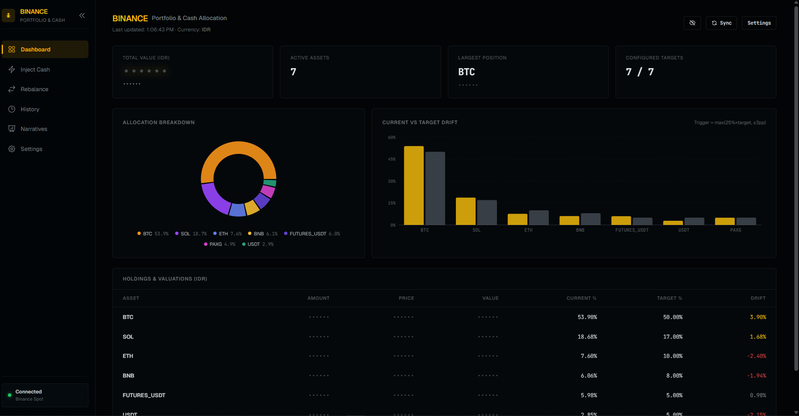
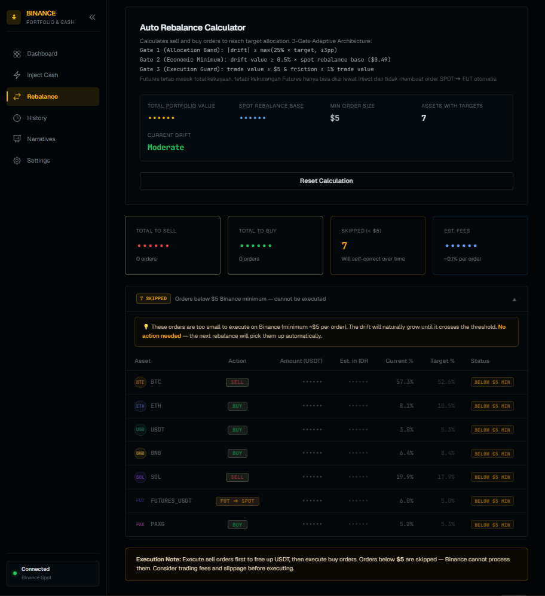
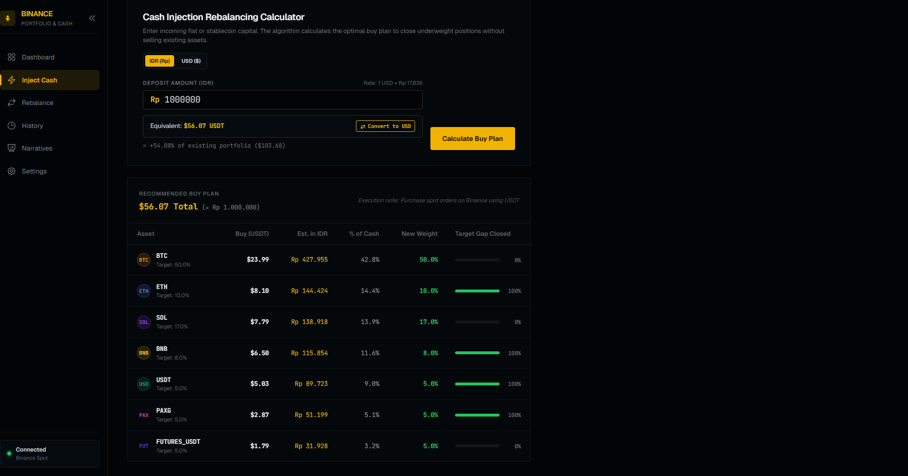
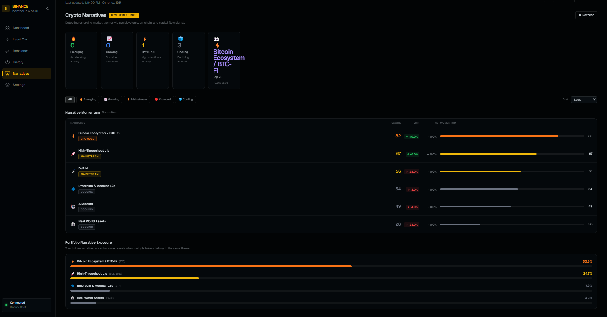
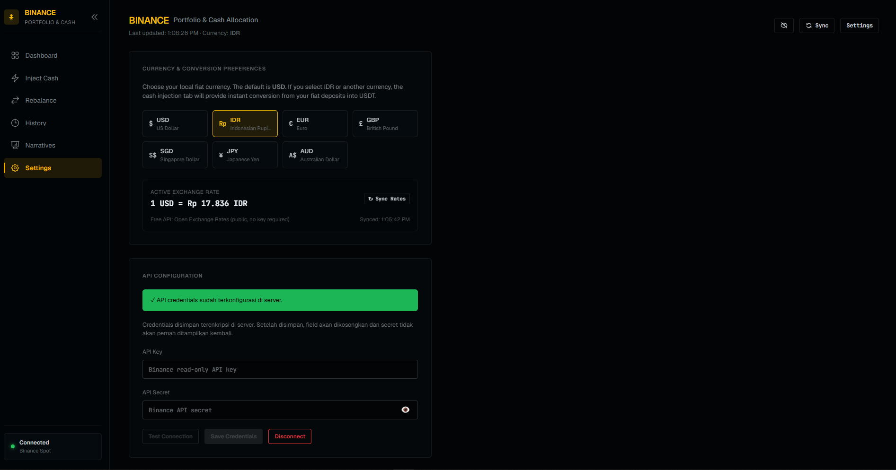
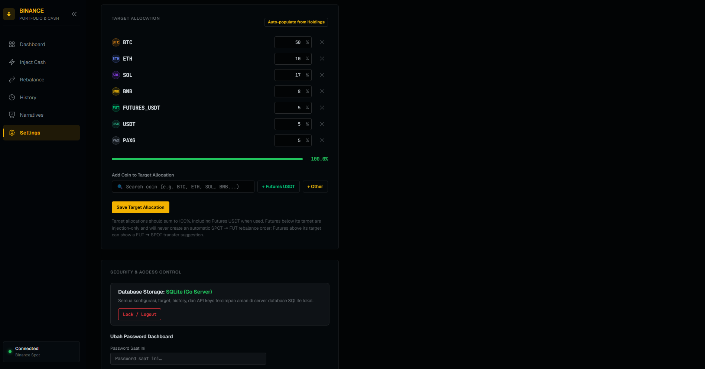

# 📊 Binance Portfolio Allocation

> Real-time crypto portfolio tracker, rebalancer, and narrative intelligence dashboard — powered by your Binance read-only API key.


---

## ✨ Features

| Feature | Description |
|---|---|
| 📈 **Dashboard** | Live holdings, allocation pie chart, drift bar chart, rebalance alerts |
| ⚡ **Inject** | Calculate exactly how much to buy when adding fresh capital |
| 🔄 **Rebalance** | Drift-triggered sell/buy plan to restore target weights |
| 🕐 **History** | Portfolio value over time, BTC-denominated tracking |
| 🧠 **Narratives** | Emerging crypto theme detection via social, volume, on-chain & capital flow signals |
| ⚙️ **Settings** | API key management, target allocations, currency, FX rates |

---

## 🏗️ Stack

**Frontend**
- React 19 + TypeScript — component-per-page architecture with co-located hooks
- Vite 8 with React Compiler enabled
- Tailwind CSS 4 + DaisyUI 5 — dark theme, `oklch` color system
- Recharts — allocation pie + drift bar charts

**Backend** (`/server`)
- Go with Fiber — REST API, HMAC-signed Binance proxy, FX rate fetching
- Narrative scoring engine — aggregates signals into lifecycle-aware scores
- Lightweight file-based persistence (no external DB required in dev)

---

## 🚀 Getting Started

### Prerequisites
- Node.js ≥ 20
- Go ≥ 1.22
- [Air](https://github.com/air-verse/air) for backend hot-reload (`go install github.com/air-verse/air@latest`)

### Install & Run

```bash
# Install frontend deps
npm install

# Run frontend + backend concurrently
npm run dev
```

Frontend → `http://localhost:5173`  
Backend API → `http://localhost:8080`

### First-time Setup

1. Open the app — the onboarding screen will guide you through adding your **Binance read-only API key**.
2. Alternatively, click **Explore Demo** to load simulated balances without any API key.
3. Head to **Settings** to configure target allocations per asset.

---

## 📁 Project Structure

```
├── src/
│   ├── components/     # Page-level UI components
│   ├── hooks/          # Co-located data + state hooks (one per component)
│   ├── lib/            # Pure logic: portfolio math, narrative helpers
│   ├── services/       # API call layer (fetch wrappers)
│   ├── types/          # Shared TypeScript interfaces
│   └── utils/          # Currency conversion, storage, formatting
│
└── server/
    └── internal/
        ├── binance/    # Binance REST API client (HMAC auth)
        ├── handler/    # HTTP route handlers
        ├── narratives/ # Narrative scoring engine
        ├── portfolio/  # Portfolio calculation logic
        ├── fx/         # FX rate fetching
        ├── config/     # App config & env
        ├── db/         # Persistence layer
        └── middleware/ # Auth, CORS, request logging
```

---

## 📸 Screenshots

| Dashboard | Rebalance |
|---|---|
|  |  |

| Inject Capital | Narratives |
|---|---|
|  |  |

| Settings — API Key | Settings — Targets |
|---|---|
|  |  |

---

## 🔐 Privacy & Security

- API keys are stored **locally in your browser** (`localStorage`) — never sent to any third-party.
- The Go backend acts as a **HMAC-signing proxy**: your secret key signs requests server-side so it is never exposed to the browser.
- Only **read-only** Binance endpoints are used — no trading permissions required or requested.

---

## 📖 Architecture

See [`docs/wiki/architecture.md`](docs/wiki/architecture.md) for the full system diagram and data flow.
