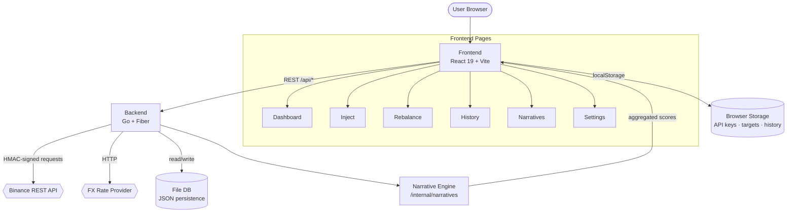
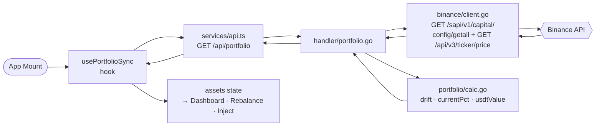
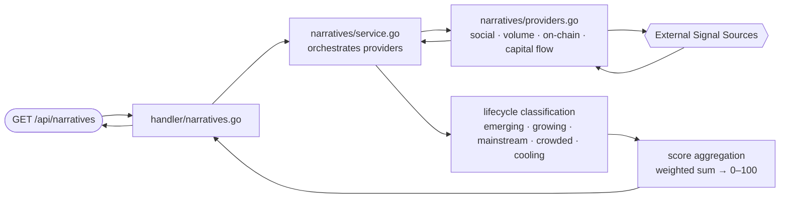

# Architecture

The app is split into two processes: a **Vite/React frontend** (port 5173) and a **Go/Fiber backend API** (port 8080). The frontend never calls Binance directly — all authenticated requests are proxied through the Go server, which holds the HMAC signing logic. State lives mostly in React component hooks; there is no global client-side store.

---

## System Diagram

---

## Components

| Layer | Component | Responsibility |
|---|---|---|
| Frontend | `src/components/` | One file per page; purely presentational, delegates logic to hooks |
| Frontend | `src/hooks/` | Data fetching, derived state, user interactions — one hook per page |
| Frontend | `src/lib/` | Pure functions: portfolio math (`fmtPct`, drift calc), narrative label maps |
| Frontend | `src/services/` | `fetch` wrappers for every backend endpoint |
| Frontend | `src/utils/` | Currency conversion, localStorage helpers, formatting |
| Backend | `internal/handler/` | HTTP route registration and request/response shaping |
| Backend | `internal/binance/` | Binance REST client — HMAC-SHA256 signing, spot + funding balance fetch |
| Backend | `internal/narratives/` | Signal aggregation, lifecycle classification, score computation |
| Backend | `internal/portfolio/` | Portfolio-level calculations (weighted drift, rebalance math) |
| Backend | `internal/fx/` | FX rate fetching and caching |
| Backend | `internal/config/` | Env-based config struct |
| Backend | `internal/middleware/` | Auth header validation, CORS, request logging |
| Backend | `internal/db/` | Lightweight JSON file persistence |

---

## Data Flow — Portfolio Load

---

## Data Flow — Narrative Scoring

---

## Key Design Decisions

- **No global state manager** — each page hook (`useDashboard`, `useRebalance`, etc.) owns its slice of derived state. Data flows down via props from `App.tsx` after `usePortfolioSync` fetches it once.
- **Backend as signing proxy** — the browser never touches the Binance secret key. The Go server receives a forwarded request, attaches the HMAC signature, and returns the result.
- **Demo mode** — a hardcoded asset set can be loaded without any API key, exercising the full UI and math paths offline.
- **Currency abstraction** — all internal values are stored in USDT; `convertUSDToCurrency` + `useCurrencyRates` handle display-time conversion using cached FX rates.
- **Narrative lifecycle** — each narrative is classified into one of five stages (`emerging → growing → mainstream → crowded → cooling`) based on signal velocity, not just absolute score.
