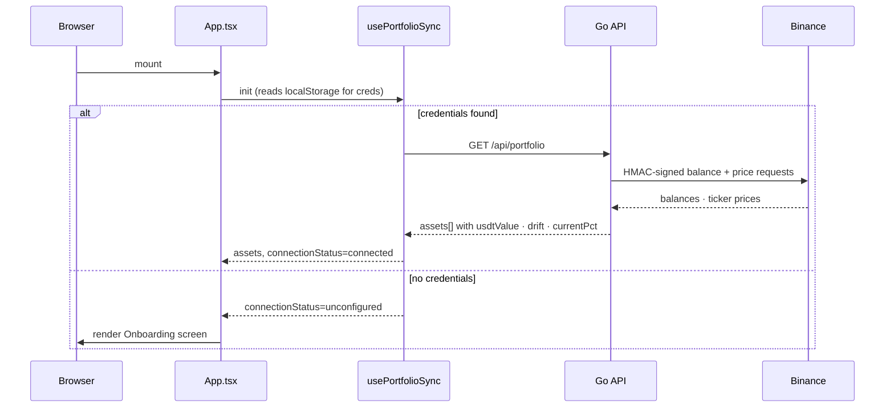
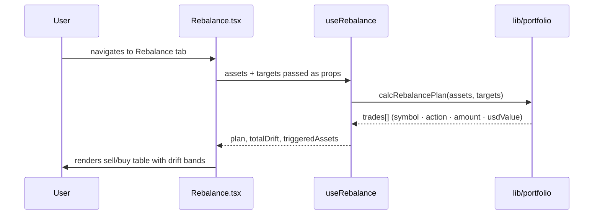
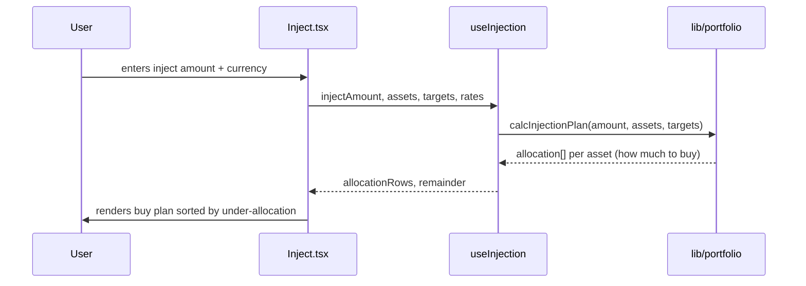
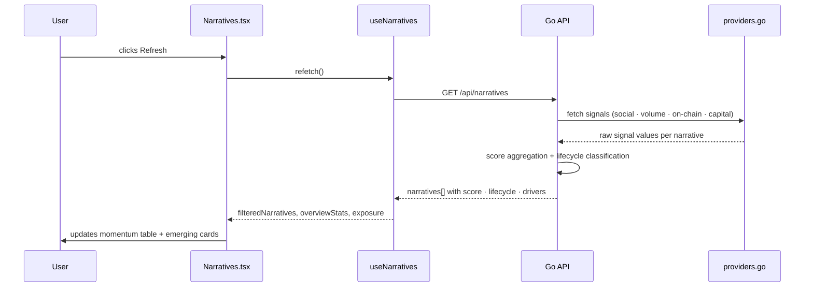

# Sequence Diagrams

## 1. App Boot & Portfolio Sync

```mermaid
sequenceDiagram
    participant Browser
    participant App.tsx
    participant usePortfolioSync
    participant Go API
    participant Binance

    Browser->>App.tsx: mount
    App.tsx->>usePortfolioSync: init (reads localStorage for creds)
    alt credentials found
        usePortfolioSync->>Go API: GET /api/portfolio
        Go API->>Binance: HMAC-signed balance + price requests
        Binance-->>Go API: balances · ticker prices
        Go API-->>usePortfolioSync: assets[] with usdtValue · drift · currentPct
        usePortfolioSync-->>App.tsx: assets, connectionStatus=connected
    else no credentials
        usePortfolioSync-->>App.tsx: connectionStatus=unconfigured
        App.tsx->>Browser: render Onboarding screen
    end
```

---

## 2. Rebalance Plan Generation

```mermaid
sequenceDiagram
    participant User
    participant Rebalance.tsx
    participant useRebalance
    participant lib/portfolio

    User->>Rebalance.tsx: navigates to Rebalance tab
    Rebalance.tsx->>useRebalance: assets + targets passed as props
    useRebalance->>lib/portfolio: calcRebalancePlan(assets, targets)
    lib/portfolio-->>useRebalance: trades[] (symbol · action · amount · usdValue)
    useRebalance-->>Rebalance.tsx: plan, totalDrift, triggeredAssets
    Rebalance.tsx->>User: renders sell/buy table with drift bands
```

---

## 3. Capital Injection Calculation

```mermaid
sequenceDiagram
    participant User
    participant Inject.tsx
    participant useInjection
    participant lib/portfolio

    User->>Inject.tsx: enters inject amount + currency
    Inject.tsx->>useInjection: injectAmount, assets, targets, rates
    useInjection->>lib/portfolio: calcInjectionPlan(amount, assets, targets)
    lib/portfolio-->>useInjection: allocation[] per asset (how much to buy)
    useInjection-->>Inject.tsx: allocationRows, remainder
    Inject.tsx->>User: renders buy plan sorted by under-allocation
```

---

## 4. Narrative Score Refresh

```mermaid
sequenceDiagram
    participant User
    participant Narratives.tsx
    participant useNarratives
    participant Go API
    participant providers.go

    User->>Narratives.tsx: clicks Refresh
    Narratives.tsx->>useNarratives: refetch()
    useNarratives->>Go API: GET /api/narratives
    Go API->>providers.go: fetch signals (social · volume · on-chain · capital)
    providers.go-->>Go API: raw signal values per narrative
    Go API->>Go API: score aggregation + lifecycle classification
    Go API-->>useNarratives: narratives[] with score · lifecycle · drivers
    useNarratives-->>Narratives.tsx: filteredNarratives, overviewStats, exposure
    Narratives.tsx->>User: updates momentum table + emerging cards
```
